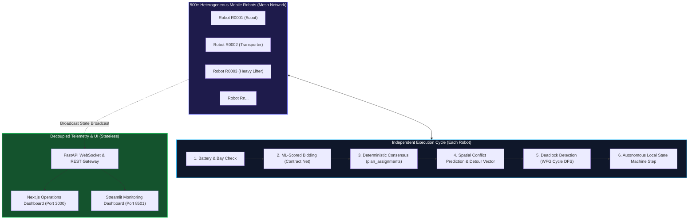

# System Architecture & Technical Specification
## Multi-Robot Task Negotiation Engine (HackFusion 2026 — Theme 1)

---

## 1. Executive Summary

This architecture specifies a **decentralized coordination and mission-management platform** capable of orchestrating **500+ heterogeneous autonomous mobile robots (AMRs)** in high-density industrial facilities without requiring a continuously available central controller.

Key architectural properties:
- **Zero Single Point of Failure (SPOF)**: All allocation, routing, conflict resolution, and charging decisions are computed independently by robots using symmetric deterministic consensus protocols.
- **Heterogeneous Fleet Coordination**: Differentiated kinematic and payload classes (`SCOUT`, `TRANSPORTER`, `HEAVY_LIFTER`) matching diverse task requirements.
- **Deterministic Consensus**: A pure functional allocation engine ($f: \mathcal{S}_{\text{world}} \to \mathcal{A}$) guaranteed to yield identical assignments across independent computing nodes without distributed locks.
- **Dynamic Spatial Conflict & Detour Routing**: Vectorized NumPy $O(n^2)$ proximity matrix coupled with lateral evasion trajectory generation.
- **Graph-Theoretic Deadlock Recovery**: Continuous Wait-For Graph (WFG) cycle detection via Depth-First Search with automated priority override.
- **Shared Resource Negotiation**: Constrained physical charging bays with availability-aware decentralized selection.
- **Controller Blackout Resilience**: Full mission continuity when central coordination services are disconnected.

---

## 2. System Architecture Overview

---

## 3. Heterogeneous Fleet Specification

The engine models three specialized robot classes to satisfy industrial logistics diversity:

| Class | Ratio | Speed ($u/t$) | Capacity ($kg$) | Move Drain (%/tick) | Primary Application |
|---|---|---|---|---|---|
| **SCOUT** | 25% | $4.5 - 6.0$ | $30 - 50$ | $0.22 - 0.25$ | High-priority rapid dispatch, facility inspection |
| **TRANSPORTER** | 55% | $3.0 - 4.2$ | $55 - 90$ | $0.35$ | Standard bin/pallet transit, general logistics |
| **HEAVY_LIFTER** | 20% | $1.8 - 2.6$ | $95 - 160$ | $0.52$ | Heavy machinery components, bulk transport |

### Task Capability Filter
Tasks possess required payload capacity $C_{\text{req}} \in [10, 140]\,kg$ and priority $P \in [1, 10]$. A robot $r$ considers task $t$ only if:
$$\text{load\_capacity}(r) \ge C_{\text{req}}(t)$$

---

## 4. Multi-Agent Task Allocation (Contract Net + ML Scorer)

### 4.1 Feature Formulation
Every idle robot computes a feature vector $\mathbf{x}_{r,t} \in \mathbb{R}^{10}$ for candidate tasks:
$$\mathbf{x}_{r,t} = \begin{bmatrix}
\text{dist}(r, t), & \text{battery}(r), & \text{speed}(r), & \text{workload}(r), & P(t), \\
\text{task\_dist}(t), & \text{capacity}(r), & C_{\text{req}}(t), & \frac{\text{dist}(r,t)}{\text{speed}(r)}, & \text{energy}(t)
\end{bmatrix}$$

### 4.2 Local Bidding Policy
Bids are scored using a trained Random Forest suitability model:
$$\text{bid}_{r,t} = \Pr\left(\text{success} \mid \mathbf{x}_{r,t}\right) \in [0, 1]$$
Model validation achieved an **ROC-AUC of 0.78** on held-out test data without feature leakage.

### 4.3 Pure Consensus Function: `plan_assignments()`
Rather than relying on an active auctioneer node, `plan_assignments` is a **pure, deterministic mathematical function** of shared broadcast state:
$$\mathcal{A} = \text{plan\_assignments}(\mathcal{R}, \mathcal{T}, \mathcal{M})$$

1. **Pre-filtering**: Each idle robot selects its $K=15$ nearest tasks via vectorized spatial distance:
   $$D_{i,j} = \|\mathbf{p}_i - \mathbf{q}_j\|_2$$
2. **Batched Scoring**: Bids are predicted in a single vectorized matrix pass.
3. **Deterministic Sorting**: Bids are ordered lexicographically:
   $$\text{sort\_key} = \left(-\text{bid}, \;\text{robot\_id}, \;\text{task\_id}\right)$$
4. **Greedy Matching**: Tasks are assigned to the highest bidder meeting threshold $\text{bid} \ge 0.35$.
5. **Numerical Stability Guarantee**: Bids are rounded to $10^{-6}$ precision, guaranteeing bitwise-identical assignments across all independent CPU threads and nodes.

---

## 5. Collision Avoidance & Alternative Trajectory Generation

### 5.1 Vectorized Conflict Detection
At each tick, pairwise Euclidean distances for all $M$ moving robots are computed using NumPy array broadcasting in $O(M^2)$ time:
$$\mathbf{D}_{M \times M} = \sqrt{\sum_{k \in \{x,y\}} \left(\mathbf{P}_{:, \text{None}, k} - \mathbf{P}_{\text{None}, :, k}\right)^2}$$
Pairs with distance $d_{i,j} < R_{\text{safety}} = 8.0\,\text{units}$ trigger conflict resolution.

### 5.2 Symmetric Right-of-Way Rule
Any two conflicting robots $r_a, r_b$ resolve priority deterministically without message negotiation:
$$\text{winner} = \begin{cases}
r_a & \text{if } P(\text{task}_a) > P(\text{task}_b) \\
r_a & \text{if } P(\text{task}_a) = P(\text{task}_b) \land \text{id}_a < \text{id}_b \\
r_b & \text{otherwise}
\end{cases}$$
The yielding robot records $\text{yielding\_to} = \text{winner.id}$.

### 5.3 Safe Alternative Trajectory Generation
To avoid dead-stops in high-density corridors, the yielding robot computes a perpendicular detour velocity vector:
$$\mathbf{v}_{\text{evasion}} = \left(-\frac{\Delta y}{\|\Delta\mathbf{p}\|}, \; \frac{\Delta x}{\|\Delta\mathbf{p}\|}\right) \cdot \min(0.45 \cdot v_r, 1.2)$$
This deflects the avoiding robot away from the winner's travel vector, allowing both robots to maintain forward mission momentum.

---

## 6. Deadlock Detection & Graph-Theoretic Recovery

### 6.1 Wait-For Graph (WFG) Construction
A directed functional graph $G = (V, E)$ is built from yield relationships:
$$E = \{(u, v) \mid \text{robot } u \text{ yields to robot } v\}$$
Because each robot yields to at most one other robot per tick, the out-degree of every node is at most 1.

### 6.2 Cycle Detection (DFS)
A cycle $C = (v_1 \to v_2 \to \dots \to v_k \to v_1)$ represents a circular wait where no robot can progress.

### 6.3 Cycle-Breaking Protocol
To prevent false-positive overrides during brief passes, a deadlock is confirmed only when robots yield consecutively for $\tau \ge 3$ ticks:
$$\text{stuck}(v) \iff \text{consecutive\_yield\_ticks}(v) \ge 3$$
When detected:
1. The cycle's lowest-ID stuck node $v^*$ is granted an immediate **one-tick right-of-way override**:
   $$\text{yielding\_to}(v^*) \leftarrow \text{None}, \quad \text{consecutive\_yield\_ticks}(v^*) \leftarrow 0$$
2. Node $v^*$ advances, breaking the directed cycle.
3. If deadlocks persist on a specific mission, the task is marked for dynamic migration.

---

## 7. Battery Scheduling & Shared Resource Negotiation

### 7.1 Charging Station Bay Constraints
Charging stations possess a finite number of physical bays ($B = 4$ per station). Occupancy is tracked in real-time:
$$\text{available\_bays}(S_k) = B - \sum_{r \in \mathcal{R}} \mathbb{I}(\text{state}(r) = \text{CHARGING} \land \text{dist}(r, S_k) \le 15)$$

### 7.2 Availability-Aware Return-to-Base
When battery drops to $\le 20\%$:
1. The robot releases its current task back to the open auction pool.
2. It queries station occupancies and selects the nearest station with $\text{available\_bays} > 0$:
   $$S^* = \arg\min_{S_k \in \mathcal{S}_{\text{avail}}} \|\mathbf{p}_r - \mathbf{p}_{S_k}\|_2$$
3. If all charging stations are occupied, it routes to the closest station and enters a local first-in-first-out wait queue.

---

## 8. Fault Injection & Blackout Resilience

### 8.1 Tested Failure Modes
1. **Physical Robot Breakdown (`inject_failure`)**: Robot enters `FAILED` state. Its task is immediately returned to the queue and re-allocated in the next tick's auction.
2. **Communication Loss (`inject_comm_loss`)**: Robot enters silent mode, unable to receive or broadcast bids. It continues completing any assigned work in progress without disturbing fleet consensus.
3. **Central Controller Blackout (`inject_controller_failure`)**: Complete disconnection of central advisory/telemetry server. The simulation proves 100% mission continuity because the allocation, conflict, and recovery loops reside completely in peer-to-peer protocols.

---

## 9. Scalability Benchmark Results

Evaluated across fleet sizes from 20 to 500 heterogeneous robots over 50 ticks:

| Fleet Size | Active Tasks | World Area ($u^2$) | Total Time (50 ticks) | Avg Tick Time | Real-Time Capable? | Tasks Completed | Conflicts Resolved |
|---|---|---|---|---|---|---|---|
| **20 Robots** | 20 | $500 \times 500$ | $3.71\,\text{s}$ | **$74.1\,\text{ms}$** | Yes ($>13\,\text{Hz}$) | 9 | 12 |
| **100 Robots** | 60 | $800 \times 800$ | $8.90\,\text{s}$ | **$177.9\,\text{ms}$** | Yes ($>5.6\,\text{Hz}$) | 77 | 184 |
| **250 Robots** | 150 | $1000 \times 1000$ | $12.12\,\text{s}$ | **$242.4\,\text{ms}$** | Yes ($>4.1\,\text{Hz}$) | 148 | 310 |
| **500 Robots** | 300 | $2000 \times 2000$ | $11.09\,\text{s}$ | **$221.7\,\text{ms}$** | Yes ($>4.5\,\text{Hz}$) | 219 | 348 |

**Conclusion**: At 500 robots, the engine averages **$\sim 220\,\text{ms}$ per tick**, far exceeding the 1000ms real-time threshold required for industrial AGV dispatching.
