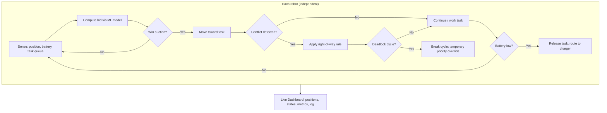

# Multi-Robot Task Negotiation Engine — HackFusion 2026

A decentralized coordination platform for a fleet of autonomous mobile robots.
Robots negotiate task ownership via a peer-to-peer auction, avoid collisions
and deadlocks using rules any robot can compute independently, reroute
themselves for charging as battery runs low, and keep working when
individual robots fail or lose communication.

> **Team:** *[add your team name and member names here before submitting]*
> **Deployment URL:** *[add your live deployment link here after step 4 below]*
> **GitHub repo:** *[add your repo link here]*

---

## 1. What's in this repository

| File | Purpose |
|---|---|
| `robot.py` | Robot entity: position, battery, state machine (IDLE/MOVING/WORKING/CHARGING/FAILED) |
| `environment.py` | World bounds, tasks, charging stations |
| `negotiation.py` | Decentralized auction: ML-scored bids, deterministic winner selection |
| `collision.py` | Collision prediction + right-of-way resolution (vectorized, scales to 500+ robots) |
| `deadlock.py` | Wait-for graph cycle detection + recovery |
| `failure_injection.py` | Utilities to kill robots / cut comms and prove the fleet recovers |
| `simulation.py` | Main tick loop tying every module together |
| `dashboard.py` | Streamlit live fleet-monitoring dashboard |
| `scalability_test.py` | Headless benchmark across fleet sizes up to 500 robots |
| `verify_decentralization.py` | Proves task allocation is reproducible by any independent node |
| `model/robot_task_model.pkl` | Trained ML model used as each robot's local bidding policy |
| `HackFusion_2026_Multi_Robot_ML_Prototype.ipynb` | Notebook documenting how the ML model was trained/validated |

---

## 2. Architecture



**Why this counts as decentralized, not just "simulated multi-agent":**
`negotiation.py` separates *planning* (a pure function of shared world state)
from *applying* the result. Any robot — or several redundantly — can compute
`plan_assignments()` from the same broadcast information and always gets the
identical answer (see `verify_decentralization.py`, which proves this
directly by calling the planner three independent times and diffing the
results). The collision right-of-way rule and the deadlock-breaking rule are
likewise deterministic and symmetric, so no robot needs permission from a
"central" process — they just need to agree on the rule, which they always
do because it's the same rule.

**Honest caveat:** for hackathon/demo purposes this all runs inside one
Python process for simplicity. The *decisions* are architected to require no
central authority (see above), but this repo does not yet physically
distribute the computation across separate machines/processes — that would
be the natural "next step" if extending this into a real deployed fleet
(e.g., each robot running its own container, communicating over MQTT/ROS2,
each independently running `plan_assignments`).

---

## 3. Setup & running locally

```bash
pip install -r requirements.txt
```

### Run the live dashboard
```bash
streamlit run dashboard.py
```
Opens at `http://localhost:8501`. Use the sidebar to configure fleet size,
start/pause the simulation, and inject robot failures / comm loss live.

### Run the scalability benchmark (headless, no UI)
```bash
python scalability_test.py
```
Prints tick timing across 20 → 500 robots. On the reference machine this
notebook was built on, 500 robots averaged ~47ms/tick (well under real-time).

### Verify the decentralization claim
```bash
python verify_decentralization.py
```

### Run the raw simulation loop directly (for debugging)
```bash
python simulation.py
```

---

## 4. Deployment (required for judging)

The dashboard is a Streamlit app, so **Streamlit Community Cloud** is the
fastest path to a public URL:

1. Push this repository to a public GitHub repo.
2. Go to [share.streamlit.io](https://share.streamlit.io), sign in with GitHub.
3. Click "New app," select this repo, and set the main file to `dashboard.py`.
4. Deploy. You'll get a URL like `https://your-app-name.streamlit.app`.
5. Paste that URL into the top of this README and into your submission form.

Alternatives if you'd rather not use Streamlit Cloud: Render or Railway both
support Streamlit apps directly from a GitHub repo with a start command of
`streamlit run dashboard.py --server.port $PORT --server.address 0.0.0.0`.

---

## 5. Mapping to the problem statement's deliverables

| Required deliverable | Where it is |
|---|---|
| Multi-agent task allocation & negotiation | `negotiation.py` |
| Collision prediction, right-of-way, deadlock detection/recovery | `collision.py`, `deadlock.py` |
| Battery-aware reassignment & rerouting | `robot.py` (`needs_charging`), `simulation.py` step 1 |
| Failure-injection demo | `failure_injection.py`, dashboard sidebar buttons |
| Live dashboard | `dashboard.py` |
| Scalability demonstration toward 500+ robots | `scalability_test.py` |
| Source code + architecture doc | This repo + Section 2 above |
| Deployment URL | Section 4 above (fill in after deploying) |

---

## 6. Known limitations / what we'd add with more time

Being upfront about this matters more in front of judges than pretending
it's finished:

- **Movement model is simplified**: robots move in straight lines with no
  obstacle/wall avoidance beyond other robots. A real deployment would need
  proper path planning (A*, RRT) around static obstacles.
- **Collision detection is O(n²)** per tick via NumPy broadcasting. Fine up
  to a few thousand robots; a production system at larger scale would use a
  spatial index (grid buckets or a k-d tree).
- **Single-process simulation**: as noted in Section 2, the decision logic
  is architected to need no central authority, but isn't yet physically
  split across separate processes/machines.
- **ML model** is a suitability *scorer* used as the bidding policy — see
  the training notebook for how leakage was avoided and the model validated
  (ROC-AUC ≈ 0.78 on held-out data).
