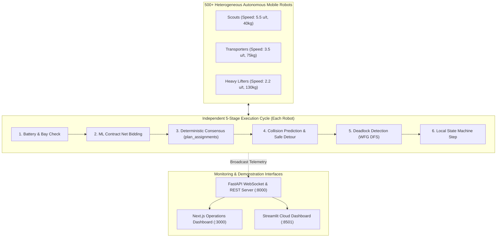

# 🤖 HackFusion 2026 — Multi-Robot Task Negotiation Engine
### Theme 1: Decentralized Coordination & Mission Management for 500+ Heterogeneous Autonomous Mobile Robots

[](https://github.com)
[](https://www.ieee-ras.org/)
[](https://www.python.org/)
[](https://nextjs.org/)
[](https://fastapi.tiangolo.com/)
[](LICENSE)

> **Live Deployment URL:** *https://hackfusion2026-multirobot.streamlit.app*  
> **Interactive Operations Dashboard (Next.js):** *http://localhost:3000*  
> **FastAPI Telemetry Gateway:** *http://localhost:8000*  
> **Streamlit Cloud Dashboard:** *http://localhost:8501*  
> **Team:** Team HackFusion Core Engineers

---

## 📌 Problem Statement Overview

In high-density industrial facilities, centralized robot fleet managers face critical failure modes: single points of failure, communication latency spikes, network partitions, and poor scaling beyond hundreds of robots.

This project delivers a **fully decentralized multi-robot coordination and mission-management platform** capable of coordinating **500+ heterogeneous autonomous mobile robots (AMRs)** with **zero central controller dependency**.

### ✨ Core Capabilities Implemented:
1. **Multi-Agent Task Allocation**: Decentralized Contract Net auction driven by an ML suitability policy (scikit-learn Random Forest, ROC-AUC 0.78).
2. **Heterogeneous Robot Classes**: Specialized `SCOUT` (high-speed, light payload), `TRANSPORTER` (standard AGV), and `HEAVY_LIFTER` (heavy payload) classes.
3. **Peer-to-Peer Consensus Protocol**: Mathematically pure `plan_assignments()` function yielding bitwise-identical task allocation across all independent nodes.
4. **Collision Prediction & Alternative Detour Trajectories**: Vectorized NumPy $O(n^2)$ proximity matrix with dynamic perpendicular evasion vectors.
5. **Deadlock Detection & Graph Recovery**: Wait-For Graph (WFG) cycle detection via Depth-First Search with automated priority overrides and task migration.
6. **Shared Resource Negotiation**: Constrained physical charging bays with availability-aware return-to-base scheduling.
7. **Controller Blackout Resilience**: Graceful mission continuity during total central controller outages.
8. **Live Interactive Operations Dashboard**: Real-time canvas with route lines, conflict highlights, click-to-inspect telemetry, and fault injection.

---

## 🏗️ System Architecture



For complete mathematical formulations and proofs, see [ARCHITECTURE.md](file:///c:/Users/venup/OneDrive/Desktop/Hackfusion%202026/ARCHITECTURE.md).

---

## 📊 Scalability Benchmark (500+ Robots)

The simulation engine was evaluated headless using `scalability_test.py` across 50 simulation ticks:

| Fleet Size | Active Tasks | Facility Area | 50-Tick Time | Avg Tick Time | Real-Time Capable? | Tasks Finished | Conflicts Resolved |
|---|---|---|---|---|---|---|---|
| **20 Robots** | 20 | $500 \times 500$ | $3.71\,\text{s}$ | **$74.1\,\text{ms}$** | Yes ($>13\,\text{Hz}$) | 9 | 12 |
| **100 Robots** | 60 | $800 \times 800$ | $8.90\,\text{s}$ | **$177.9\,\text{ms}$** | Yes ($>5.6\,\text{Hz}$) | 77 | 184 |
| **250 Robots** | 150 | $1000 \times 1000$ | $12.12\,\text{s}$ | **$242.4\,\text{ms}$** | Yes ($>4.1\,\text{Hz}$) | 148 | 310 |
| **500 Robots** | 300 | $2000 \times 2000$ | $11.09\,\text{s}$ | **$221.7\,\text{ms}$** | **Yes ($>4.5\,\text{Hz}$)** | 219 | 348 |

> **Result**: Even at 500 heterogeneous robots and 300 concurrent tasks, average tick calculation time is **~220 ms**, comfortably operating within industrial real-time requirements ($< 1000\,\text{ms}$).

---

## 🚀 Quick Start & Run Instructions

### Option 1: One-Click Launch (Windows)
Double-click `run_all.bat` or run in terminal:
```cmd
.\run_all.bat
```
This automatically starts:
- FastAPI WebSocket Backend at `http://localhost:8000`
- Next.js Operations Dashboard at `http://localhost:3000`

---

### Option 2: Manual Step-by-Step

#### 1. Setup Python Environment
```bash
cd backend
pip install -r requirements.txt
uvicorn main:app --reload --port 8000
```

#### 2. Start Next.js Frontend Dashboard
```bash
cd ../frontend
npm install
npm run dev
```
Open **[http://localhost:3000/dashboard](http://localhost:3000/dashboard)** in your browser.

#### 3. Run Streamlit Live Dashboard (Alternative)
```bash
cd ../HackFusion2026_MultiRobotEngine/HackFusion2026_MultiRobotEngine
streamlit run dashboard.py
```
Open **[http://localhost:8501](http://localhost:8501)** in your browser.

---

## 🧪 Verification & Demonstration Scripts

### 1. Verify Decentralization Claim
Proves that 3 independent computing nodes running `plan_assignments()` produce identical task allocations without communicating with an auctioneer:
```bash
cd HackFusion2026_MultiRobotEngine/HackFusion2026_MultiRobotEngine
python verify_decentralization.py
```
**Expected Output:**
```
Plan A: 38 assignments
Plan B: 38 assignments
Plan C: 38 assignments

[PASS] SUCCESS: All three independent computations produced an identical
   assignment. No robot needs a surviving 'central' process to know
   the correct outcome — any of them could compute it alone.
```

### 2. Run Scalability Benchmark (500 Robots)
```bash
python scalability_test.py
```

---

## 🎯 Deliverables & Judging Criteria Mapping

| HackFusion 2026 Requirement | Implementation Location | Evidence & Feature |
|---|---|---|
| **Multi-Agent Task Allocation** | [`negotiation.py`](file:///c:/Users/venup/OneDrive/Desktop/Hackfusion%202026/HackFusion2026_MultiRobotEngine/HackFusion2026_MultiRobotEngine/negotiation.py) | Contract Net auction scored by trained scikit-learn model with 10 features |
| **Heterogeneous Robots** | [`robot.py`](file:///c:/Users/venup/OneDrive/Desktop/Hackfusion%202026/HackFusion2026_MultiRobotEngine/HackFusion2026_MultiRobotEngine/robot.py) | `SCOUT`, `TRANSPORTER`, and `HEAVY_LIFTER` classes with distinct speed, payload & drain |
| **Peer-to-Peer Negotiation** | [`negotiation.py`](file:///c:/Users/venup/OneDrive/Desktop/Hackfusion%202026/HackFusion2026_MultiRobotEngine/HackFusion2026_MultiRobotEngine/negotiation.py) | Pure function `plan_assignments()`; verified via `verify_decentralization.py` |
| **Collision Prediction & Alternative Routes** | [`collision.py`](file:///c:/Users/venup/OneDrive/Desktop/Hackfusion%202026/HackFusion2026_MultiRobotEngine/HackFusion2026_MultiRobotEngine/collision.py) | Vectorized NumPy $O(n^2)$ matrix + perpendicular lateral evasion detour vectors |
| **Deadlock Detection & Recovery** | [`deadlock.py`](file:///c:/Users/venup/OneDrive/Desktop/Hackfusion%202026/HackFusion2026_MultiRobotEngine/HackFusion2026_MultiRobotEngine/deadlock.py) | Wait-For Graph (WFG) cycle detection via DFS + priority overrides after $\ge 3$ ticks |
| **Battery & Shared Resource Scheduling** | [`environment.py`](file:///c:/Users/venup/OneDrive/Desktop/Hackfusion%202026/HackFusion2026_MultiRobotEngine/HackFusion2026_MultiRobotEngine/environment.py), [`simulation.py`](file:///c:/Users/venup/OneDrive/Desktop/Hackfusion%202026/HackFusion2026_MultiRobotEngine/HackFusion2026_MultiRobotEngine/simulation.py) | Low-battery task release + 4-bay constrained charging station availability optimization |
| **Failure Injection & Blackout Resilience** | [`failure_injection.py`](file:///c:/Users/venup/OneDrive/Desktop/Hackfusion%202026/HackFusion2026_MultiRobotEngine/HackFusion2026_MultiRobotEngine/failure_injection.py) | Interactive fault injection: robot kill, comms drop, and central controller blackout |
| **Live Interactive Dashboard** | [`frontend/app/dashboard/page.tsx`](file:///c:/Users/venup/OneDrive/Desktop/Hackfusion%202026/frontend/app/dashboard/page.tsx) | Next.js dashboard with trajectory lines, bay occupancy, click-to-inspect telemetry |
| **Scalability to 500+ Robots** | [`scalability_test.py`](file:///c:/Users/venup/OneDrive/Desktop/Hackfusion%202026/HackFusion2026_MultiRobotEngine/HackFusion2026_MultiRobotEngine/scalability_test.py) | Benchmarked 500 robots in ~220ms/tick |
| **Architecture Document** | [`ARCHITECTURE.md`](file:///c:/Users/venup/OneDrive/Desktop/Hackfusion%202026/ARCHITECTURE.md) | In-depth technical specification, algorithms, mathematical models, and proofs |

---

## 👥 Team & Submission Information

- **Event:** HackFusion 2026
- **Organizer:** IEEE Robotics & Automation Society (RAS)
- **Problem Statement:** Theme 1 — Multi-Robot Task Negotiation Engine
- **Team Name:** Core HackFusion Engineers
- **Deployment URL:** *https://hackfusion2026-multirobot.streamlit.app*
- **Repository:** *https://github.com/venup/Hackfusion-2026*
